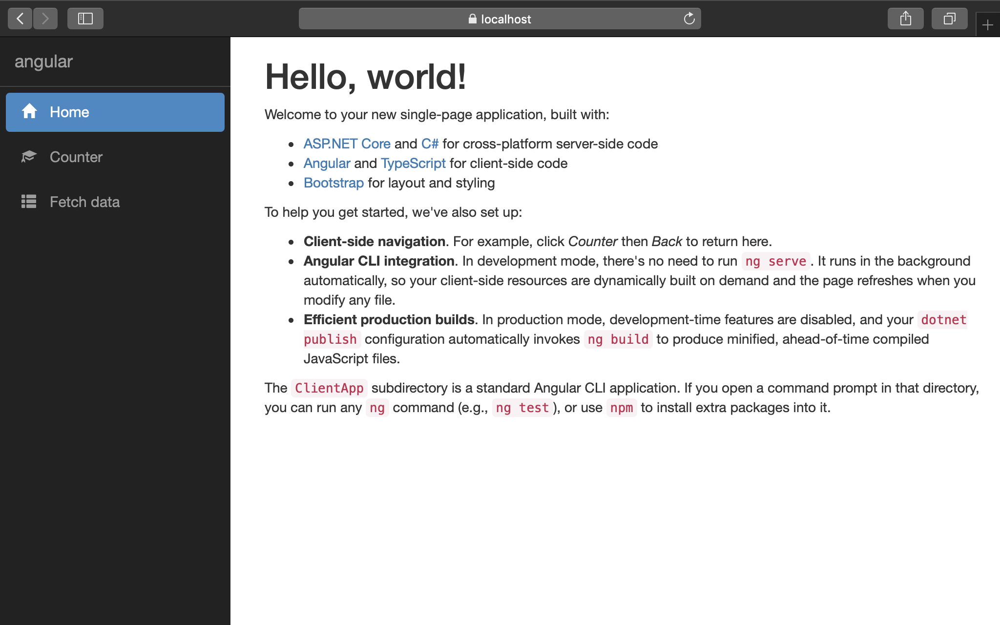
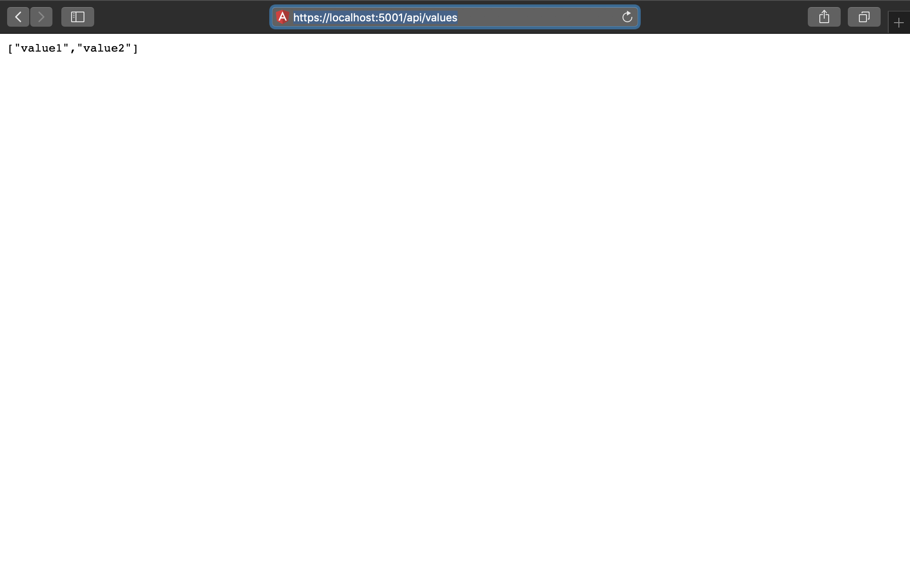
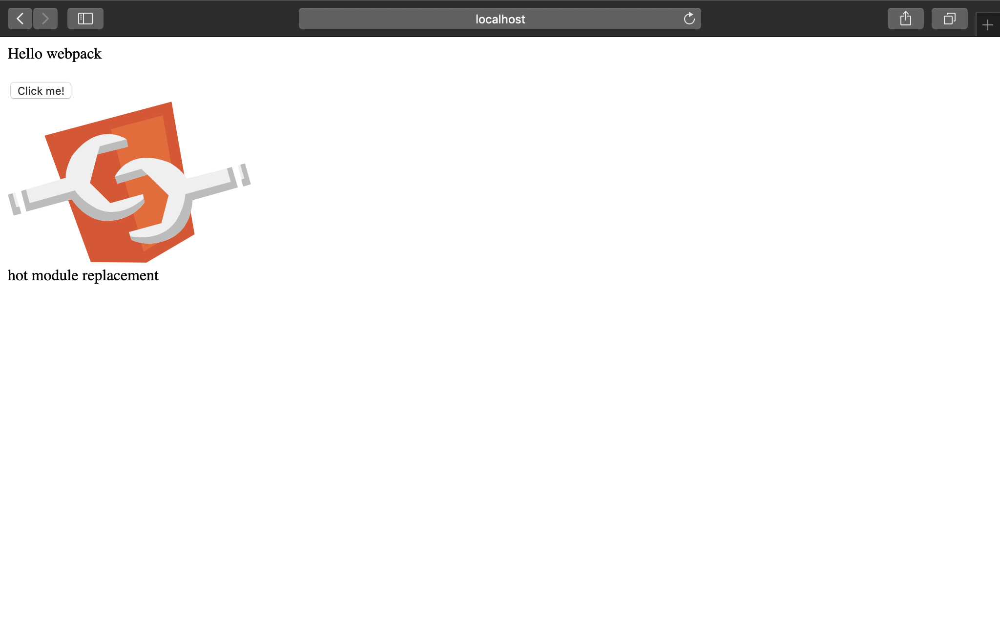

# Präsentation Suva 22.01.2019

## Server

### ASP.NET CORE 2.1

- Open Source
- Plattformunabhängig
- C#

#### ASP.NET Core 2.1 mit Angular Starter Template

```bash
dotnet new angular
```



project.csproj

```xml
    <PackageReference Include="Microsoft.AspNetCore.App" />
    <PackageReference Include="Microsoft.AspNetCore.Razor.Design" Version="2.1.2" PrivateAssets="All" />
    <PackageReference Include="Microsoft.AspNetCore.SpaServices.Extensions" Version="2.1.1" />
```

_Verworfen weil zu enge Verwebung von Client & Server_

#### ASP.NET WebAPI

```bash
dotnet new webapi
```



project.csproj

```xml
    <PackageReference Include="Microsoft.AspNetCore.App" />
    <PackageReference Include="Microsoft.AspNetCore.Razor.Design" Version="2.1.2" PrivateAssets="All" />
```

## Client

### Angular (2+)

#### Angular CLI

- Erstellen eines lauffähigen Client

```bash
ng new client
```

- Start des Clients

```bash
./client/ng serve
```

- Start mit Hilfe von node.js


#### NG eject

- Aufhebung der Webpack-Kapselung der Angular CLI

**angular.json**

```json
{
  "$schema": "./node_modules/@angular/cli/lib/config/schema.json",
  "version": 1,
  "newProjectRoot": "projects",
  "projects": {
    "cliStarter": {
      "root": "",
      "sourceRoot": "src",
      "projectType": "application",
      "prefix": "app",
      "schematics": {
        "@schematics/angular:component": {
          "styleext": "scss"
        }
      },
      "architect": {
        "build": {
          "builder": "@angular-devkit/build-angular:browser",
          "options": {
            "outputPath": "dist/cliStarter",
            "index": "src/index.html",
            "main": "src/main.ts",
            "polyfills": "src/polyfills.ts",
            "tsConfig": "src/tsconfig.app.json",
            "assets": [
              "src/favicon.ico",
              "src/assets"
            ],
            "styles": [
              "src/styles.scss"
            ],
            "scripts": []
          },
```
**bash:**
```bash
ng eject
```

_The 'eject' command has been disabled and will be removed completely in 8.0.
The new configuration format provides increased flexibility to modify the
configuration of your workspace without ejecting._

### Webpack


At its core, webpack is a static module bundler for modern JavaScript applications. When webpack processes your application, it internally builds a dependency graph which maps every module your project needs and generates one or more bundles.

**webpack.dev.js:**

```javascript
const path = require('path');

const webpack = require('webpack');

const HtmlWebpackPlugin = require('html-webpack-plugin');
const CopyWebpackPlugin = require('copy-webpack-plugin');
const CleanWebpackPlugin = require('clean-webpack-plugin');
const FilterWarningsPlugin = require('webpack-filter-warnings-plugin');

const helpers = require('./webpack.helpers');

const ROOT = path.resolve(__dirname, '..');

console.log('@@@@@@@@@ USING DEVELOPMENT @@@@@@@@@@@@@@@');
process.traceDeprecation = true;

module.exports = {

    mode: 'development',
    devtool: 'source-map',
    performance: {
        hints: false
    },
    entry: {
        polyfills: './angularApp/polyfills.ts',
        vendor: './angularApp/vendor.ts',
        app: './angularApp/main.ts'
    },
```

**webpack.prod.js:**

```javascript
const path = require('path');

const webpack = require('webpack');

const HtmlWebpackPlugin = require('html-webpack-plugin');
const CopyWebpackPlugin = require('copy-webpack-plugin');
const CleanWebpackPlugin = require('clean-webpack-plugin');
const ngToolsWebpack = require('@ngtools/webpack');
const FilterWarningsPlugin = require('webpack-filter-warnings-plugin');
const OfflinePlugin = require('offline-plugin');

const helpers = require('./webpack.helpers');

const ROOT = path.resolve(__dirname, '..');

console.log('@@@@@@@@@ USING PRODUCTION @@@@@@@@@@@@@@@');
process.traceDeprecation = true;

module.exports = {
    mode: 'production',
    entry: {
        vendor: './angularApp/vendor.ts',
        polyfills: './angularApp/polyfills.ts',
        app: './angularApp/main-aot.ts' // AoT compilation
    },

    output: {
        path: ROOT + '/wwwroot/',
        filename: 'dist/[name].[hash].bundle.js',
        chunkFilename: 'dist/[id].[hash].chunk.js',
        publicPath: '/'
    },

    resolve: {
        extensions: ['.ts', '.js', '.json']
    },
```


## Datenbanken

### NoSql

- Cosmos DB (Azure)
- Couchbase
- MongoDB

## MongoDB


- Platzhirsch
- Opensource
- Plattformunabhängig
- JSON
- Javascript-Cli

```javascript
db.inventory.find( { status: { $in: [ "A", "D" ] } } )
```

entspricht im SQL

```sql
SELECT * FROM inventory WHERE status in ("A", "D")
```

- .NET Core Driver

```csharp
//1. Connect to MongoDB instance running on localhost
var client = new MongoClient();

//Access database named 'test'
var database = client.GetDatabase("test");

//Access collection named 'restaurants'
var collection = database.GetCollection("restaurants");
```

- Online University

### SQL

- PostgreSQL
- MySQL
- Azure SQL
- MariaDB

### Maria DB


- Opensource
- MySql Derrivat
- Plattformunabhängig

## Hosting

### Varianten

- Azure (Mircosoft Cloud)
- Hosting (.NET Core)
- Zu Hause 

### Zu Hause

Webserver mit Datenbanken