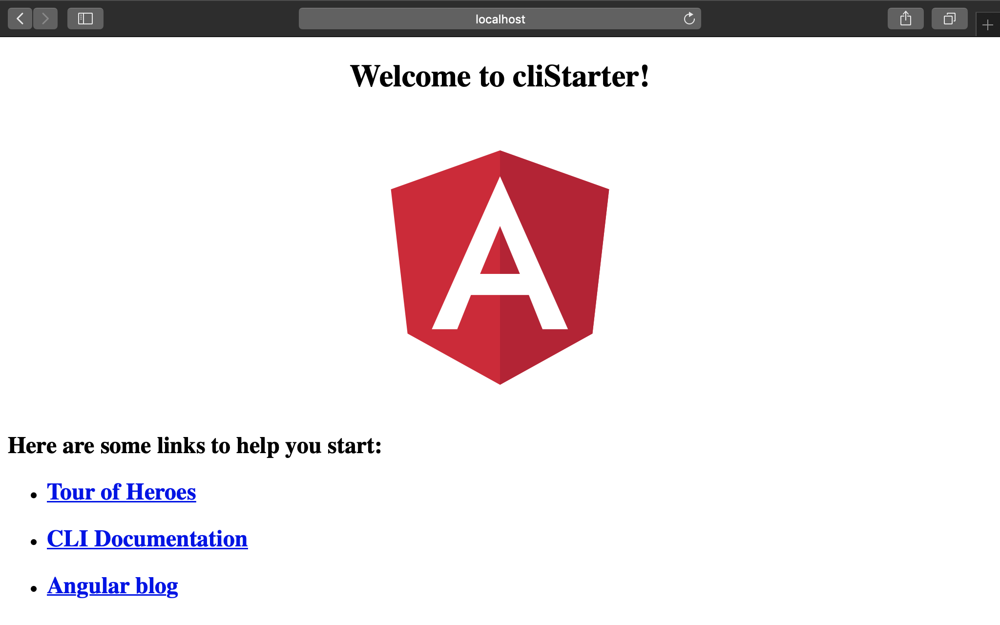
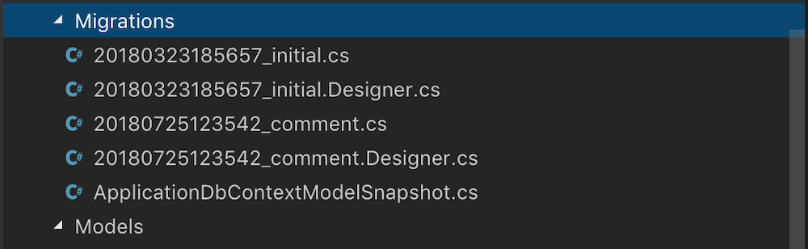
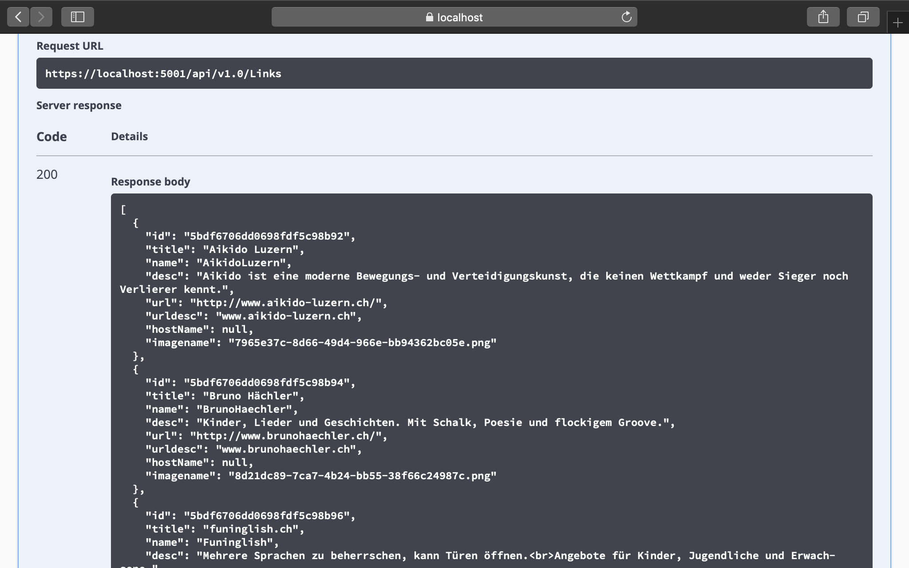

<!-- theme: uncover -->
<!-- class: invert -->

### Präsentation

# 'Pet Project' kinderkultur.ch 2.0

##### von Linus Wieland

#### @SUVA 22.01.2019
---

## Übersicht

<!-- footer: Linus' Pet Project @SUVA 2019 - Übersicht -->

- Live-Demo kinderkultur.ch
- Server
- Client
- Datenbanken
- Hosting
- Live-Demo kinderkultur.ch 2.0

---

<!-- footer: Linus' Pet Project @SUVA 2019 -->

---

### kinderkultur.ch

- Reine Info-Website
- HTML5
- Bootstrap 3.x

---

### Live-Demo kinderkultur.ch

---


---

<!-- footer: Linus' Pet Project @SUVA 2019 -->

---

## kinderkultur.ch 2.0: Server

---

### Servertechnologien (Auswahl)

- Python
- Java
- .NET

<!-- footer: Linus' Pet Project @SUVA 2019 - Server -->

---
<!-- footer: Linus' Pet Project @SUVA 2019 - Server -->


>ASP.NET Core is a cross-platform, high-performance, open-source framework for building modern, cloud-based, Internet-connected applications

---

### ASP.NET CORE 2.1

- Open Source
- Plattformunabhängig
- C#

---

#### ASP.NET Core 2.1 mit Angular Starter Template

```bash
dotnet new angular
```

---


---

**project.csproj:**

```xml
    <PackageReference Include="Microsoft.AspNetCore.App" />
    <PackageReference Include="Microsoft.AspNetCore.Razor.Design"
        Version="2.1.2" PrivateAssets="All" />
    <PackageReference
        Include="Microsoft.AspNetCore.SpaServices.Extensions"
        Version="2.1.1" />
```

_Verworfen weil zu enge Verwebung von Client & Server_

---

#### ASP.NET Core 2.1 WebAPI

```bash
dotnet new webapi
```

---


---

**project.csproj:**

```xml
    <PackageReference Include="Microsoft.AspNetCore.App" />
    <PackageReference Include="Microsoft.AspNetCore.Razor.Design" 
        Version="2.1.2" PrivateAssets="All" />
```

---

<!-- footer: Linus' Pet Project @SUVA 2019 -->

---

## kinderkultur.ch 2.0: Client

<!-- footer: Linus' Pet Project @SUVA 2019 - Client -->

---

### Clienttechnologien (Auswahl)

- Angular
- React
- Vue
- ASP.NET Razor

<!-- footer: Linus' Pet Project @SUVA 2019 - Client -->

---


> Angular helps you build modern applications for the web, mobile, or desktop. 

---

### Angular (2+)

- Opensource
- Plattformunabhängig
- Typescript

---

#### Angular CLI

```bash
ng new client
```

```bash
./client/ng serve
```

_Startet mit Hilfe von node.js_

---



---

#### NG eject

- Aufhebung der Webpack-Kapselung der Angular CLI

---

**angular.json**

```json
{
  "$schema": "./node_modules/@angular/cli/lib/config/schema.json",
  "version": 1,
  "newProjectRoot": "projects",
  "projects": {
    "cliStarter": {
      "root": "",
      "sourceRoot": "src",
      "projectType": "application",
      "prefix": "app",
      "schematics": {
        "@schematics/angular:component": {
          "styleext": "scss"
        }
      },
```

---

**bash:**

```bash
ng eject
```

>The 'eject' command has been disabled and will be removed completely in 8.0.
The new configuration format provides increased flexibility to modify the
configuration of your workspace without ejecting.

---


>webpack is a static module bundler for modern JavaScript applications

---

**webpack.dev.js:**

```javascript
module.exports = {

    mode: 'development',
    devtool: 'source-map',
    performance: {
        hints: false
    },
    entry: {
        polyfills: './angularApp/polyfills.ts',
        vendor: './angularApp/vendor.ts',
        app: './angularApp/main.ts'
    },
```

---

**webpack.prod.js:**

```javascript
module.exports = {
    mode: 'production',
    entry: {
        vendor: './angularApp/vendor.ts',
        polyfills: './angularApp/polyfills.ts',
        app: './angularApp/main-aot.ts' // AoT compilation
    },

    output: {
        path: ROOT + '/wwwroot/',
        filename: 'dist/[name].[hash].bundle.js',
        chunkFilename: 'dist/[id].[hash].chunk.js',
        publicPath: '/'
    },
```

---


---

<!-- footer: Linus' Pet Project @SUVA 2019 -->

---

## kinderkultur.ch 2.0: Datenbanken

<!-- footer: Linus' Pet Project @SUVA 2019 - Datenbanken -->

---

<!-- footer: Linus' Pet Project @SUVA 2019 - Datenbanken -->

### NoSQL (Dokumentbasierende) Datenbanken (Auswahl)

- Cosmos DB (Azure)
- Couchbase
- MongoDB

---


>MongoDB is a distributed database at its core, so high availability, horizontal scaling, and geographic distribution are built in and easy to use.

---

#### Mongo DB

- Platzhirsch
- Opensource
- Plattformunabhängig
- BSON (JSON) Datenhaltung

---

- Javascript-Cli:

```javascript
db.inventory.find( { status: { $in: [ "A", "D" ] } } )
```

_entspricht im SQL_

```sql
SELECT * FROM inventory WHERE status in ("A", "D")
```

---

- .NET Core Driver:

```csharp
//1. Connect to MongoDB instance running on localhost
var client = new MongoClient();

//Access database named 'test'
var database = client.GetDatabase("test");

//Access collection named 'restaurants'
var collection = database.GetCollection("restaurants");
```

- Online University

---

### OR-Mapping

<!-- footer: Linus' Pet Project @SUVA 2019 -->

---


---

<!-- footer: Linus' Pet Project @SUVA 2019 - Datenbanken -->

#### Entity Framework Core

- Ausschlaggebender Punkt: Identity on ASP.NET Core als SQL Datenbank
- Code First Ansatz ist schwierig im NoSQL

---



---


---

<!-- footer:  -->

### SQL (Relationale) Datenbanken (Auswahl)

- PostgreSQL
- MySQL
- Azure SQL
- MariaDB

---


---

#### Maria DB

- Opensource
- MySql Derrivat
- Plattformunabhängig

---

<!-- footer:  -->

## kinderkultur.ch 2.0: Hosting

---
<!-- footer: Linus' Pet Project @SUVA 2019 - Hosting -->

### Hosting- Möglichkeiten (Auswahl)

- Azure (Microsoft Cloud)
- Hosting (.NET Core)
- Zu Hause

---

### Zu Hause

Webserver mit Datenbanken

---


---

- Technologieunabhängigkeit
- DevOps Know How
- Linux Know How

---

<!-- footer:  -->

### Docker

---
<!-- footer: Linus' Pet Project @SUVA 2019 - Docker -->


---

- Technologieunabhängigkeit
- Einfachere Installationsroutinen
- Backup Hosting
- Läuft auf Heimserver

---

**docker-compse.yml:**

```yml
version: '3'

services:
  mongodb:
    container_name: mongodbKinderkultur
    image: mongo
    env_file: .env
    environment:
      MONGO_INITDB_ROOT_USERNAME: ${MONGO_INITDB_ROOT_USERNAME}
      MONGO_INITDB_ROOT_PASSWORD: ${MONGO_INITDB_ROOT_PASSWORD}
      MONGO_INITDB_DATABASE: ${MONGO_INITDB_DATABASE}
    networks:
      - webapi-network
    ports:
      - "27017:27017"
```

---

**bash:**

```bash
docker images

REPOSITORY                     TAG                 IMAGE ID            CREATED             SIZE
backup-mongodb-before-mojave   latest              4499d0d18f33        2 months ago        361MB
backup-mariadb-before-mojave   latest              cd18449acf21        2 months ago        396MB
```

---

**StartServer-Script:**

```bash
#!/bin/bash
docker start mariadbKinderkultur
docker start mongodbKinderkultur
dotnet run
```

---

<!-- footer:  -->

## kinderkultur.ch 2.0: Demo

---
<!-- footer: Linus' Pet Project @SUVA 2019 - Demo -->

### Server

---

#### Swagger

Tool zum Designen und Testen von RESTful Webservices

```xml
<PackageReference Include="NSwag.AspNetCore"
    Version="11.17.21" />
```

---


---


---



---

#### Versioning

Versionierung der API URL

- Release vs. Production

```xml
<PackageReference Include="Microsoft.AspNetCore.Mvc.Versioning"
    Version="2.3.0" />
```

---

#### Source Code

---


---

### Client

---


---


---


---


---


---


---

## Ende

Besten Dank!

---
